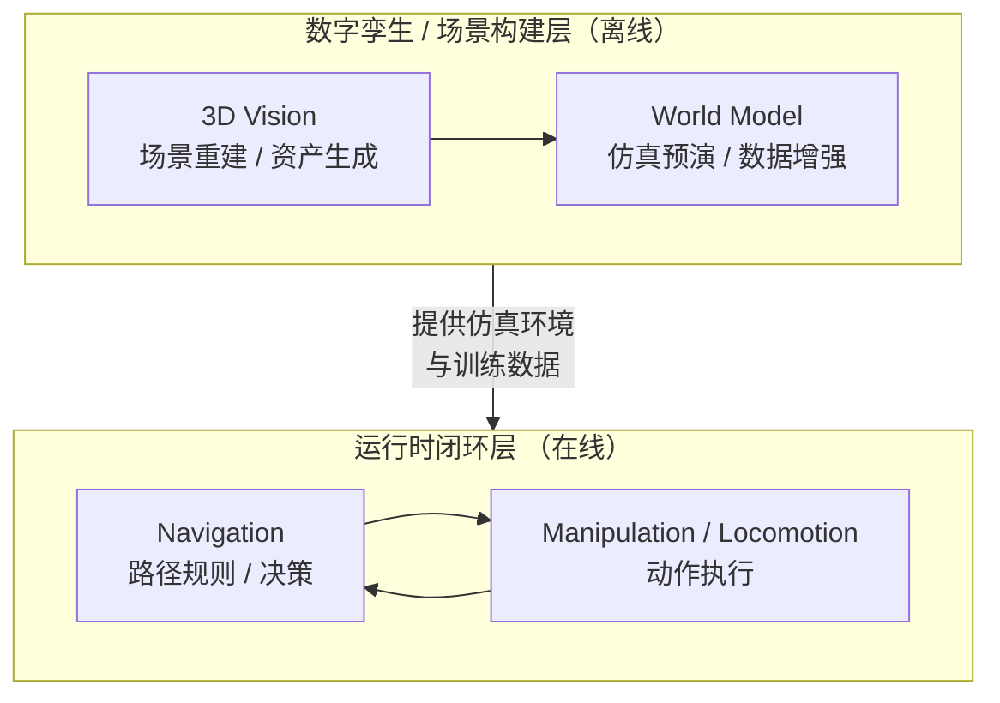

# CANN Recipes for Embodied Intelligence

## 🚀 Latest News
- [2026/05] NMR 神经运动重定向模型在昇腾 Atlas A3 上已支持[训练和推理](locomotion/NMR)，可将人体 SMPL-X 动作重定向到 Unitree G1 人形机器人，样例已开源。
- [2026/05] AgiBot 机械臂世界模型样例在昇腾 Atlas A2 上已支持[训练](world_model/agibot-arm-world-model/train)与[在线推理](world_model/agibot-arm-world-model/infer_with_torch)，样例已开源。
- [2026/05] 仓库已由 `cann-recipes-embodied-intelligence` 正式更名为 `cann-recipes-embodied-ai`，新地址：https://gitcode.com/CANN/cann-recipes-embodied-ai ，原有链接将自动跳转。
- [2026/05] 3DGS算法在昇腾Atlas A2上已支持[训练和推理](3d_vision/gaussian_splatting)，基于NPU实现Alpha-blending、视锥剔除、负载均衡、Precise Intersection等融合算子优化，样例已开源。
- [2026/04] Hunyuan3D 2.0 三维生成与渲染模型在昇腾Atlas A2上[推理](3d_vision/Hunyuan3D)已支持，增加dit-cache方案优化，样例已开源。
- [2026/04] Pi0模型支持在昇腾Atlas A2上[训练](manipulation/pi0/train)，样例已开源。
- [2026/04] SmolVLA模型支持在昇腾Atlas A2上[训练](manipulation/smolvla/train)，样例已开源。
- [2026/04] ACT模型支持在昇腾Atlas A2上[训练](manipulation/act/train)，样例已开源。
- [2026/04] Pi0.5模型在昇腾Ascend 310P上已支持[OM静态图推理](manipulation/pi05/infer_with_om)部署，样例已开源。
- [2026/03] LQC模型在昇腾 A2上已支持[训练和推理](locomotion/LQC)，样例已开源。
- [2026/03] Pi0.5模型在昇腾Ascend 310P上已支持[在线推理](manipulation/pi05/infer_with_torch)部署，样例已开源。
- [2026/02] Isaac-GR00T N1.6模型在昇腾Atlas A3上已支持[推理](manipulation/Isaac-GR00T)，样例已开源。
- [2026/02] Cosmos-Predict2.5-2B世界模型在昇腾Atlas A3上已支持[推理](world_model/cosmos-predict2.5)，样例已开源。
- [2026/02] Cosmos-Transfer2.5-2B世界模型在昇腾Atlas A3上已支持[推理](world_model/cosmos-transfer2.5)，样例已开源。
- [2026/02] Alpamayo-R1智驾模型在昇腾Atlas A2上已支持[推理](navigation/alpamayo-r1)，样例已开源。
- [2026/01] Spirit v1.5模型在昇腾Ascend 310P上已支持[推理](manipulation/spirit-v1.5/infer_with_torch)，样例已开源。
- [2025/12] Pi0模型在昇腾Ascend 310P上已支持[推理](manipulation/pi0/infer_with_om)，样例已开源。
- [2025/12] OpenVLA模型在昇腾Ascend 310P上已支持[推理](manipulation/openvla/infer_with_om)，样例已开源。
- [2025/12] DiffusionPolicy模型在昇腾Ascend 310P上已支持[推理](manipulation/diffusion-policy/infer_with_om)，样例已开源。
- [2025/12] ACT模型在昇腾Ascend 310P上已支持[推理](manipulation/act/infer_with_om)，样例已开源。
- [2025/11] Pi0模型在昇腾Atlas A2系列上已支持[推理](manipulation/pi0/infer_with_torch)，代码已开源。

## 🎉 概述

cann-recipes-embodied-ai 仓库针对具身智能领域的典型模型和加速算法，提供基于 CANN 平台的优化样例。本仓库旨在帮助开发者快速、高效地在昇腾平台上部署和优化具身智能模型，降低开发门槛，加速应用落地。

**核心特性：**
- 覆盖操作类（Manipulation）、世界模型（World Model）、导航（Navigation）、运动控制（Locomotion）、3D视觉（3D Vision）等典型场景
- 提供训练、在线推理、离线推理（OM）等多种样例
- 包含性能优化指南和精度验证方案

本仓库样例提供两种检索方式：
- **[📦 模型入口](#-模型入口)**：按模型/场景查找样例与其训练、推理链路。
- **[🧩 能力入口](#-能力入口)**：按原子化优化能力查找已落地该能力的样例，便于复用。

## 🔭 具身智能闭环概览

本仓库覆盖的 5 个模型类别，在具身智能系统中分别服务于 **数字孪生/场景构建**和**运行时闭环**两个层面：

**数字孪生层（离线）：** 3D Vision 模型负责场景重建与资产生成，为仿真环境提供高质量三维场景；World Model 在仿真环境中预演和验证行为决策，生成合成训练数据。
**运行时层（在线）：** Navigation / Manipulation / Locomotion 模型在真实或仿真环境中执行感知-决策-执行的闭环控制，驱动机器人完成任务。



## 📦 模型入口

### 操作类模型 (Manipulation)

**场景特点**：操作类模型专注于机器人手臂的运动控制与任务执行，解决抓取、放置、组装等精细操作问题。这类模型通常接收视觉观测和语言指令作为输入，输出机器人的动作序列（如关节角度、末端位姿等），适用于工业装配、家庭服务、实验室自动化等场景。

| 模型 | 平台 | 场景 | 简介 | 性能参考 |
|----|----|----|----|----|
| **Pi0** | | | | |
| [在线推理](manipulation/pi0/infer_with_torch/README.md) | Atlas A2 | 在线推理 | 基于LeRobot库，通过使能融合算子、图模式、计算逻辑优化等手段，实现较低推理时延。 | **80 ms** |
| [训练](manipulation/pi0/train/README.md) | Atlas A2 | 训练 | 支持 8 卡分布式训练与评测，默认集成已验证的训练优化。 | **81.77 samples/s** (优化后) |
| [离线推理](manipulation/pi0/infer_with_om/README.md) | Ascend 310P | 离线推理 | 基于LeRobot库，使用OM静态图进行离线推理，实现较低推理时延。 | **~270 ms** (OrangePi AI Station) |
| **Pi0.5** | | | | |
| [在线推理](manipulation/pi05/infer_with_torch/README.md) | Ascend 310P | 在线推理 | 基于PyTorch直接进行在线推理。 | **~862 ms** |
| [离线推理](manipulation/pi05/infer_with_om/README.md) | Ascend 310P | 离线推理 | 使用OM静态图进行离线推理，实现较低推理时延。 | **~410 ms** |
| [训练](manipulation/pi05/train/README.md) | Atlas A2 | 训练 | 在Atlas A2环境进行训练，精度正常，性能达到较优水平。 | **88.89 samples/s** (优化后) |
| **ACT** | | | | |
| [训练](manipulation/act/train/README.md) | Atlas A2 | 训练 | 支持 8 卡分布式训练与评测。 | **760.24 samples/s** (优化后) |
| [离线推理](manipulation/act/infer_with_om/README.md) | Ascend 310P | 离线推理 | 使用OM静态图进行离线推理，实现较低推理时延。 | **~200 ms** (OrangePi AI Station) |
| **SmolVLA** | | | | |
| [训练](manipulation/smolvla/train/README.md) | Atlas A2 | 训练 | 支持 LIBERO 数据集的多卡训练与评测。 | **233~244 samples/s** (8卡，稳定阶段) |
| **DiffusionPolicy** | | | | |
| [离线推理](manipulation/diffusion-policy/infer_with_om/README.md) | Ascend 310P | 离线推理 | 使用OM静态图进行离线推理，实现较低推理时延。 | - |
| **OpenVLA** | | | | |
| [离线推理](manipulation/openvla/infer_with_om/README.md) | Ascend 310P | 离线推理 | OpenVLA 7B模型OM离线推理，实现较低推理时延。 | - |
| **Isaac-GR00T N1.6** | | | | |
| [在线推理](manipulation/Isaac-GR00T/README.md) | Atlas A3 | 在线推理 | 通用人形机器人基础模型，适配昇腾A3平台。 | - |
| **Spirit v1.5** | | | | |
| [在线推理](manipulation/spirit-v1.5/infer_with_torch/README.md) | Ascend 310P | 在线推理 | 千寻智能自研的具身智能模型，RoboChallenge评测综合排名第一(截至2026.1.12)。 | - |

### 世界模型 (World Model)

**场景特点**：世界模型通过学习物理世界的规律，能够预测或生成未来场景的视频内容。这类模型支持文本/图像/视频等条件输入，生成符合物理一致性（如重力、碰撞、流体动力学）的视频预测，可用于策略评估、合成数据生成、闭环仿真等任务，帮助机器人系统在虚拟环境中预演和验证行为决策。

| 模型 | 平台 | 场景 | 简介 | 性能参考 |
|----|----|----|----|----|
| **Cosmos-Predict2.5-2B** | | | | |
| [在线推理](world_model/cosmos-predict2.5/README.md) | Atlas A3 | 在线推理 | Cosmos世界基础模型，支持文本/图像生成世界(Text2World/Image2World)，生成物理一致的视频。 | **~920 s** (生成5.8s视频) |
| **Cosmos-Transfer2.5-2B** | | | | |
| [在线推理](world_model/cosmos-transfer2.5/README.md) | Atlas A3 | 在线推理 | Cosmos世界基础模型，支持多控制信号(深度图/语义分割/边缘检测等)的视频风格转换。 | - |
| **AgiBot Arm World Model** | | | | |
| [训练](world_model/agibot-arm-world-model/train) | Atlas A2 | 训练 | 基于 Wan2.1-Fun-V1.1-1.3B-Control 在 AgiBotWorld 数据集上微调的机械臂世界模型，支持文本/参考图/动作轨迹条件，默认 8 卡训练。 | - |
| [在线推理](world_model/agibot-arm-world-model/infer_with_torch) | Atlas A2 | 在线推理 | 基于 PyTorch 的分块自回归推理，支持文本与轨迹引导的机械臂视频生成。 | - |

### 导航模型 (Navigation)

**场景特点**：导航模型聚焦于移动机器人或自动驾驶系统的路径规划与决策问题。这类模型融合视觉感知、环境理解和运动预测能力，在复杂动态环境中规划安全、高效的行驶路径，适用于自动驾驶、无人机导航、移动机器人避障等场景。

| 模型 | 平台 | 场景 | 简介 | 性能参考 |
|----|----|----|----|----|
| **Alpamayo-R1** | | | | |
| [在线推理](navigation/alpamayo-r1/README.md) | Atlas A2 | 在线推理 | 面向L4/L5级智能驾驶的VLA大模型(10B)，支持因果思维链推理。 | **~7.32 s** (生成10条预测轨迹) |

### 运动控制模型 (Locomotion)

**场景特点**：运动控制模型解决足式机器人（如人形机器人、四足机器人）的运动协调与平衡控制问题。这类模型基于强化学习训练，学习在不同地形条件下保持稳定行走、奔跑、跳跃等运动模式，适用于人形机器人巡检、四足机器人物流配送、救援探索等场景。

| 模型 | 平台 | 场景 | 简介 | 性能参考 |
|----|----|----|----|----|
| **LQC** | | | | |
| [训练+推理](locomotion/LQC/README.md) | Atlas A2 | 训练+推理 | 足式机器人的强化学习运动控制器，适用于G1、GO2等主流机器人型号。 | - |
| **NMR** | | | | |
| [训练+推理](locomotion/NMR/README.md) | Atlas A3 | 训练+推理 | 神经运动重定向模型，基于LLaMA Transformer将人体SMPL-X动作重定向到Unitree G1人形机器人。 | - |

### 3D视觉模型 (3D Vision)

**场景特点**：3D视觉模型涵盖三维资产生成、场景重建与新视角合成等多种任务：从文本/图像生成高保真 3D 网格与纹理（如 Hunyuan3D），从多视角图像重建相机位姿与点云（如 VGGT），以及基于高斯泼溅的实时场景渲染与优化（如 3DGS）。这类模型广泛应用于数字孪生、虚拟现实、游戏开发、建筑设计、自动驾驶感知等领域，能够显著降低三维内容创建与可视化的时间成本。

| 模型 | 平台 | 场景 | 简介 | 性能参考 |
|----|----|----|----|----|
| **Hunyuan3D 2.0** | | | | |
| [在线推理](3d_vision/Hunyuan3D/README.md) | Atlas A2 | 在线推理 | 腾讯混元三维生成与渲染模型，支持文本/图像生成高保真3D资产，带高分辨率纹理贴图。 | **~26 s** (texgen，2万平面mesh) |
|**VGGT** | | | |
|[在线推理](3d_vision/vggt/README.md)|Atlas A2/A3 | 在线推理 | 三维重建模型，支持图像生成对应的三维重建场景。| **~1.12s** (25张图片输入)|
| **3DGS** | | | | |
| [训练与推理](3d_vision/gaussian_splatting/README.md) | Atlas A2 | 训练/推理 | 基于gsplat开源加速库，针对NPU实现Alpha-blending、视锥剔除、负载均衡、Precise Intersection等融合算子优化。 | - |

## 🧩 能力入口

按训练 / 推理原子化优化能力索引到对应样例。每项能力的"适用范围"指该能力理论上可适配的样例集合，"已覆盖"为当前仓库中已落地该能力的样例。

### 训练能力

| 原子化能力 | 适用范围 | 已覆盖样例 |
|----|----|----|
| 梯度检查点精细化 | 大模型 DDP 训练（Pi0 / Pi0.5 / ACT / SmolVLA 等） | [Pi0 训练](manipulation/pi0/train/README.md)（关闭外层 suffix checkpoint）、[Pi0.5 训练](manipulation/pi05/train/README.md)（`--disable-outer-suffix-checkpoint`） |
| DDP 静态图 | 多卡 DDP 训练 | [Pi0.5 训练](manipulation/pi05/train/README.md)（`static_graph=True`） |

### 推理能力

| 原子化能力 | 适用范围 | 已覆盖样例 |
|----|----|----|
| 图模式 | 全部推理样例（torchair / OM 静态图） | [Pi0 在线](manipulation/pi0/infer_with_torch/README.md)、[Isaac-GR00T](manipulation/Isaac-GR00T/README.md)、[Hunyuan3D](3d_vision/Hunyuan3D/README.md)（torchair）；[Pi0 OM](manipulation/pi0/infer_with_om/README.md)、[Pi0.5 OM](manipulation/pi05/infer_with_om/README.md)、[ACT OM](manipulation/act/infer_with_om/README.md)、[DiffusionPolicy OM](manipulation/diffusion-policy/infer_with_om/README.md)、[OpenVLA OM](manipulation/openvla/infer_with_om/README.md)（ATC 静态图） |
| CPU 绑核与多线程 | host-bound 或含 CPU 侧渲染/光栅化的推理样例 | [Hunyuan3D](3d_vision/Hunyuan3D/README.md)（`--multi_thread` 多线程光栅化与 delighting） |
| 计算逻辑优化 | Transformer / Diffusion 等可融合算子改写的样例 | [Pi0 在线](manipulation/pi0/infer_with_torch/README.md)、[Isaac-GR00T](manipulation/Isaac-GR00T/README.md)、[Spirit v1.5](manipulation/spirit-v1.5/infer_with_torch/README.md)、[Cosmos-Predict2.5](world_model/cosmos-predict2.5/README.md)、[Cosmos-Transfer2.5](world_model/cosmos-transfer2.5/README.md)、[Alpamayo-R1](navigation/alpamayo-r1/README.md)、[Hunyuan3D](3d_vision/Hunyuan3D/README.md)、[VGGT](3d_vision/vggt/README.md)（FA / RMSNorm / Rotary / QKV 融合等） |
| DiTCache | 多步去噪的 DiT 扩散模型（Hunyuan3D、Cosmos-Predict2.5、Cosmos-Transfer2.5） | [Hunyuan3D](3d_vision/Hunyuan3D/README.md)（FBCache / TeaCache / Taylorseer） |
| 多卡序列并行 | 长序列 / 大模型推理（视频生成、多视图 3D、≥3B VLA 等） | [Cosmos-Predict2.5](world_model/cosmos-predict2.5/README.md)、[Cosmos-Transfer2.5](world_model/cosmos-transfer2.5/README.md)（Context Parallel）、[VGGT](3d_vision/vggt/README.md)（Ulysses + Ring） |
| CFG 并行 | 使用 Classifier-Free Guidance 的扩散模型 | [Cosmos-Transfer2.5](world_model/cosmos-transfer2.5/README.md)（`enable_cfg_parallel`） |
| 量化 | ≥1B 参数的大模型推理 | [VGGT](3d_vision/vggt/README.md)（W8A8，`--buildW8A8` / `--enableW8A8`） |


## 🏃 一站式平台快速体验

「一站式平台」是为开发者提供的 NPU 环境，内部已集成完整的 CANN 环境，可以直接使用。cann-recipes-embodied-ai 针对该平台在相应样例 README 中提供了简化的「快速启动」路径，帮助用户最小步骤完成 NPU 推理体验。当前支持的模型正在持续扩展中，敬请关注：

|实践|简介|
|-----|-----|
|[VGGT](3d_vision/vggt/README.md#一站式平台的快速启动)|基于PyTorch框架，在Atlas A2/A3环境中完成VGGT三维重建推理，针对一站式平台场景提供简化的启动流程，帮助用户快速上手完成一次端到端 NPU 推理体验。|
|[pi0](manipulation/pi0/infer_with_torch/README.md)|基于PyTorch框架，在Atlas A2/A3环境中完成机器人动作推理，针对一站式平台场景提供简化的启动流程，帮助用户快速上手完成一次端到端 NPU 推理体验。|


## 📖 目录结构说明

```
├─CONTRIBUTION.md
├─DISCLAIMER.md
├─LICENSE
├─README.md
├─Third_Party_Open_Source_Software_Notice
├─docs                                          # 文档目录
│   ├─3d_vision                                 # 3D视觉模型文档目录
│   │   ├─Hunyuan3D                             # Hunyuan3D相关文档
│   │   ├─vggt                                  # VGGT相关文档
│   │   └─gaussian_splatting                    # 3DGS相关文档
│   ├─manipulation                              # 操作类模型文档目录
│   │   ├─GR00T N1.6                            # Isaac-GR00T N1.6相关文档
│   │   └─pi0                                   # Pi0相关文档
│   │       ├─infer_with_om
│   │       └─infer_with_torch
│   ├─navigation                                # 导航模型文档目录
│   │   └─alpamayo-r1                           # Alpamayo-R1相关文档
│   └─world_model                               # 世界模型文档目录
│       └─Cosmos                                # Cosmos相关文档
├─manipulation                                  # 操作类模型目录
│   ├─act                                       # Action Chunking with Transformers模型样例
│   │   ├─infer_with_om                         # ACT模型om离线推理样例
│   │   └─train                                 # ACT模型训练样例
│   ├─diffusion-policy                          # DiffusionPolicy模型样例
│   │   └─infer_with_om                         # DiffusionPolicy模型om离线推理样例
│   ├─openvla                                   # OpenVLA模型样例
│   │   └─infer_with_om
│   ├─pi0                                       # Pi0模型样例
│   │   ├─infer_with_om                         # Pi0模型离线推理样例
│   │   ├─infer_with_torch                      # Pi0模型torch推理样例
│   │   └─train                                 # Pi0模型训练样例
│   ├─pi05                                      # Pi0.5模型样例
│   │   ├─infer_with_om                         # Pi0.5模型离线推理样例
│   │   ├─infer_with_torch                      # Pi0.5模型在线推理样例
│   │   └─train                                 # Pi0.5模型训练样例
│   ├─smolvla                                   # SmolVLA模型样例
│   │   └─train                                 # SmolVLA模型训练样例
│   ├─Isaac-GR00T                               # Isaac-GR00T N1.6模型样例
│   └─spirit-v1.5                               # Spirit v1.5模型样例
│       └─infer_with_torch
├─world_model                                   # 世界模型目录
│   ├─cosmos-predict2.5                         # Cosmos-Predict2.5-2B世界模型
│   ├─cosmos-transfer2.5                        # Cosmos-Transfer2.5-2B世界模型
│   └─agibot-arm-world-model                    # AgiBot 机械臂世界模型 (Wan2.1-Fun-V1.1-1.3B-Control)
│       ├─train                                 # AgiBot 训练样例
│       └─infer_with_torch                      # AgiBot torch 推理样例
├─navigation                                    # 导航模型目录
│   └─alpamayo-r1                               # Alpamayo-R1智驾模型样例
├─locomotion                                    # 运动控制模型目录
│   └─LQC                                       # Learning-based Quadruped Robot Controller运动控制模型
│   └─NMR                                       # Neural Motion Retargeting运动控制模型
├─3d_vision                                     # 3D视觉模型目录
│   ├─Hunyuan3D                                 # Hunyuan3D 2.0三维生成模型样例
│   ├─vggt                                      # VGGT三维重建模型样例
│   └─gaussian_splatting                        # 3D Gaussian Splatting训推优化样例
├─module                                        # 公共模块目录
│   └─dit_cache                                 # DiT缓存加速模块
└─ops                                            # 自定义融合算子目录
    └─ascendc                                   # 昇腾平台3DGS融合算子
```

## 📝 相关信息

- [昇腾部署通用排查手册](./docs/deployment_troubleshooting.md)：多样例共性部署问题与解决方法
- [贡献指南](./CONTRIBUTION.md)
- [许可证](./LICENSE)

    cann-recipes-embodied-ai仓涉及的模型，如模型目录下存在License的以该License为准。如模型目录下不存在License的，遵循Apache 2.0许可证。

- [免责声明](./DISCLAIMER.md)
