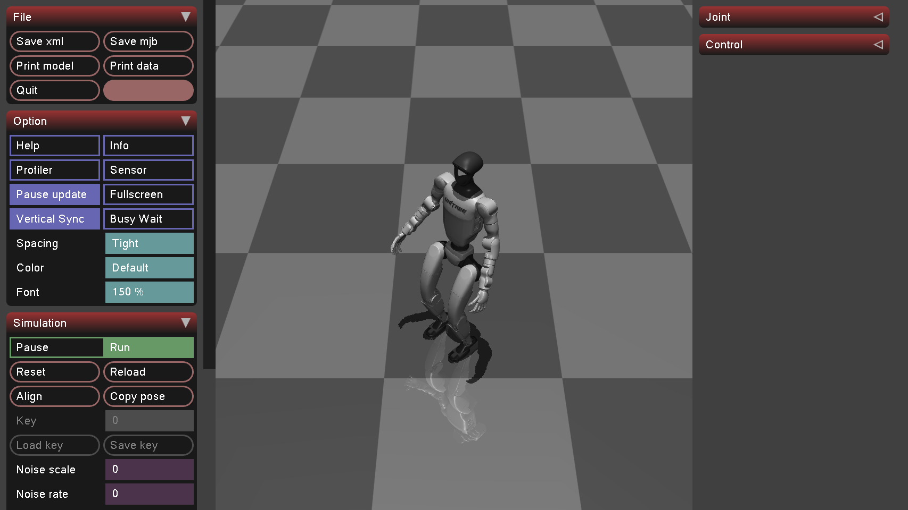

# Learning-based Quadruped Robot Controller

## 概述
Learning-based Quadruped Robot Controller (LQC) 是适用于ARM架构的昇腾A2服务器的足式机器人强化学习运动控制算法，支持宇树G1、GO2等多款主流机器人本体的模型导入、一键式训练和推理验证。本样例基于[IROS2025](#citation)的理论工作，在昇腾A2服务器上服务器上完成了优化和迁移，旨在推动昇腾服务器在足式机器人领域的场景化落地，助力足式机器人产业的智能化升级。

## 环境准备

### 拉取镜像
从[ARM镜像地址](https://cann-ai.obs.cn-north-4.myhuaweicloud.com/cann-recipes-embodied-intelligence/lqc-image.tar)中下载docker镜像，并上传到昇腾A2服务器上，通过以下命令导入镜像。

```
docker load -i lqc-image.tar
```
在昇腾服务器上加载镜像后，使用以下命令进行验证：
```
docker images
```
在昇腾服务器上指定该镜像拉起容器，注意指定对应`${container_name}`和`${image_name}`
```
docker run -itd  --privileged --net=host --ipc=host \
--device=/dev/davinci0 --device=/dev/davinci1 --device=/dev/davinci2 \
--device=/dev/davinci3 --device=/dev/davinci4 --device=/dev/davinci5 \
--device=/dev/davinci6 --device=/dev/davinci7 \
--device=/dev/davinci_manager --device=/dev/devmm_svm --device=/dev/hisi_hdc \
-v /etc/localtime:/etc/localtime -v /usr/local/dcmi:/usr/local/dcmi \
-v /usr/local/Ascend/driver:/usr/local/Ascend/driver \
-v /usr/local/Ascend/firmware:/usr/local/Ascend/firmware -v /var/log/npu/:/usr/slog \
-v /usr/local/bin/npu-smi:/usr/local/bin/npu-smi -v /sys/fs/cgroup:/sys/fs/cgroup:ro \
-v /etc/ascend_install.info:/etc/ascend_install.info \
-v /data0:/data0 -v /data1:/data1 -v /data2:/data2 -v /home:/home \
--name=${container_name} ${image_name} /bin/bash
```
进入容器
```
docker exec -it ${container_name} /bin/bash
cd ~
```
### 克隆仓库
```
git clone https://gitcode.com/cann/cann-recipes-embodied-intelligence.git /tmp/cann-recipes-embodied-intelligence
```
复制和替换cann-recipes-embodied-intelligence代码仓locomotion/LQC中所有文件到容器对应路径中
```
cp -rf /tmp/cann-recipes-embodied-intelligence/locomotion/LQC/* ~/cann-recipes-embodied-intelligence/locomotion/LQC/
```
切换到项目目录
```
cd cann-recipes-embodied-intelligence/locomotion/LQC
```
克隆剩余的子模块
```
cd extern
git config --global http.sslVerify false
git clone https://github.com/bab2min/EigenRand
git clone https://github.com/ArashPartow/exprtk
cd EigenRand && git checkout f3190cd7 && cd ..
cd exprtk && git checkout master && cd ../..
```


### 环境设置
LQC使用conda进行环境管理，并且需要MuJoCo作为物理仿真引擎、FastNoise2作为噪声生成模块，除此之外，还需要cmake、glfw3等依赖。本样例提供了环境脚本，可用于一键式下载和安装所需环境。
```
chmod +x set_env.sh
./set_env.sh
```
配置环境后，需要启动conda环境.
```
source ~/.bashrc
conda activate lltk
```

安装剩余所需的库，运行：
```
pip install -r requirements.txt
```
> 若提示`getopt`、`inspect`、`multiprocessing`缺失，是由于第三方工具包`op-compile-tool 0.1.0` 存在依赖声明缺陷，触发pip依赖解析器的虚假缺失依赖告警，该报错为非功能性异常，不影响任何代码执行。

编译项目代码：
```
python build.py --backend mujoco
```
完成编译后，验证当前训练环境是否准备完毕，将输出当前训练环境所支持的机器人类型：
```
python -c "from lltk import registry; print(registry.list_envs())"
```

### 模型资产准备
在开始训练前，需要准备三维模型文件以供MuJoCo读取，本样例提供了包括宇树G1、GO2等不同自由度的模型物理模型文件，请[下载资产](https://cann-ai.obs.cn-north-4.myhuaweicloud.com/cann-recipes-embodied-intelligence/LQC/resources.tar)后解压放置在`./resources`下。

## 训练

本样例使用以下命令启动训练，默认为`Headless`模式，在命令行中将打印训练信息：
```
python scripts/train.py -r <ROBOT> -n <RUN_NAME>
```
其中`<ROBOT>`预置了三种宇树G1的训练：
- g1：腿部12自由度，适用于平地。
- g1_15dof：15自由度，包括腿部12自由度以及腰部3自由度，适用于平地。
- g1_15dof.rough：15自由度，启用高程图，适用于崎岖地形、楼梯。

在启动训练时，会创建`logs/<TASK_NAME>/<RUN_NAME>`文件夹保存权重。

## 推理

本样例支持推理时在线渲染和离线渲染，为更好发挥昇腾服务器性能，**推荐离线渲染**方式进行模型推理验证。

### 离线渲染
使用离线渲染时，推荐安装`PyOpenGL-accelerate`库
```
pip install PyOpenGL-accelerate
```

运行以下命令启用离线渲染时，会在`/results`下创建子文件夹，并记录指定机器人的运动仿真数据生成MP4文件。

```
python scripts/play.py <RUN_DIR/WEIGHT_PATH> --command random --offline-render --record-video
```

您可以通过以下命令查看更多信息：
```
python scripts/play.py -h
```

本样例也基于宇树G1提供了训练好的权重供验证，可以[下载权重](https://cann-ai.obs.cn-north-4.myhuaweicloud.com/cann-recipes-embodied-intelligence/LQC-G1-15DOF-Rough/G1_15DOF_rough.tar)并解压到`/logs/g1_15dof.rough`文件夹后实现快速验证。

### 在线渲染

在线渲染模式下，需要通过X11接收指令并在本地屏幕渲染，建议使用[MobaXterm](https://mobaxterm.mobatek.net/)连接服务器。

> 若您当前使用ssh连接服务器，请确认`vim /etc/ssh/sshd_config`中`x11forwording yes`,并且确保MobaXterm具备X11 Forward能力，配置流程可参考[MobaXterm使用说明](https://mobaxterm.mobatek.net/documentation.html)。

本样例提供了一键式渲染环境搭建脚本，运行命令启动：
```
chmod +x set_render.sh
./set_render.sh
```
需要根据提示输入本地设备的ip地址：
```
Please enter your Windows host IP address: <ip>
```
脚本运行完毕后，可以获得MuJoCo的viwer界面。再次导入包含本地ip的Linux图形界面环境变量，运行推理命令，可以看到指定机器人在MuJoCo窗口中的仿真运动，包含机器人运动、感知、地形环境仿真数据：
```
export DISPLAY=<ip>:0.0
export LIBGL_ALWAYS_INDIRECT=0
python scripts/play.py <RUN_DIR/WEIGHT_PATH> --command random
```

<p align="middle">
  
</p>


## 项目结构
本样例的项目结构整体如下所示：
```bash
├── algorithms             # RL算法库
├── configs                # 机器人训练配置文件，包括[g1, g1_15dof, g1_15dof.rough, go2]
├── doc                    
├── extern                 # 第三方库，其中oomj为MuJoCo的二次封装接口
├── lltk                   # RL环境工具包，连接底层C++和上层Python训练算法
├── resources              # 机器人本体的物理模型文件
└── scripts                # 训练和推理入口
└── README.md
└── set_env.sh             # 一键式训练环境配置脚本
└── set_render.sh          # 在线渲染环境配置脚本
```

## Citation
```
Chengrui Zhu, Zhen Zhang, Siqi Li, Qingpeng Li, and Yong Liu. Learning Symmetric Legged Locomotion via State Distribution Symmetrization. In 2025 IEEE/RSJ International Conference on Intelligent Robots and Systems (IROS), 2025.
```
